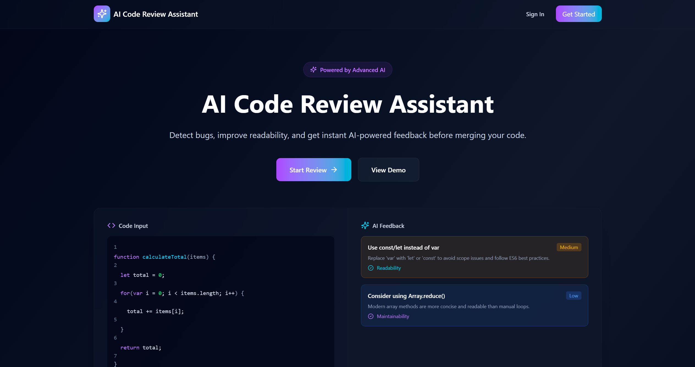
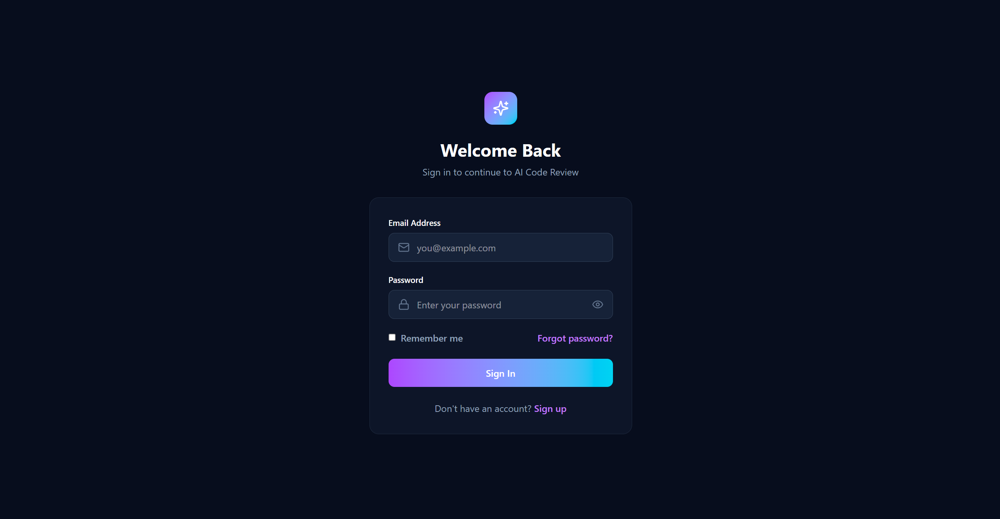
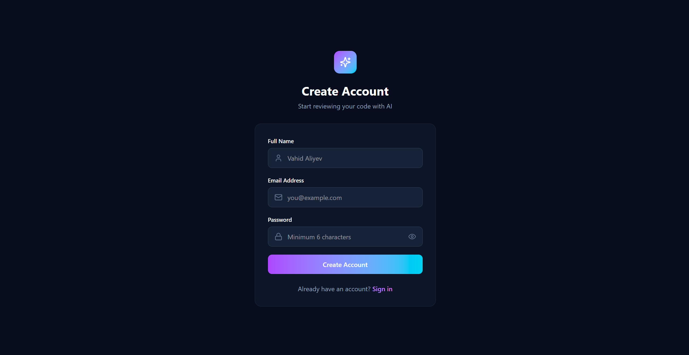
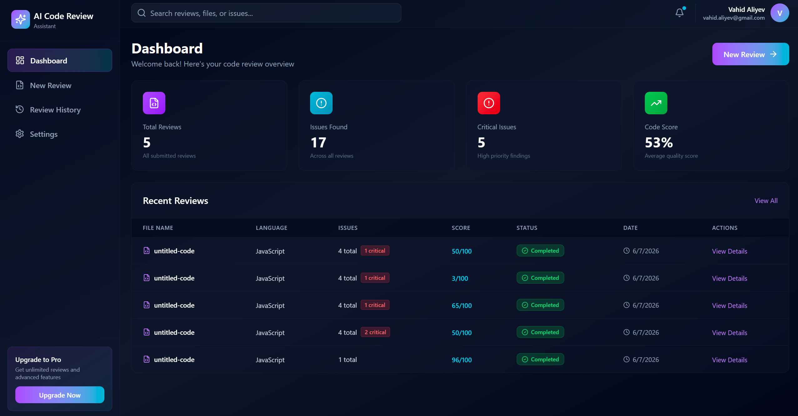
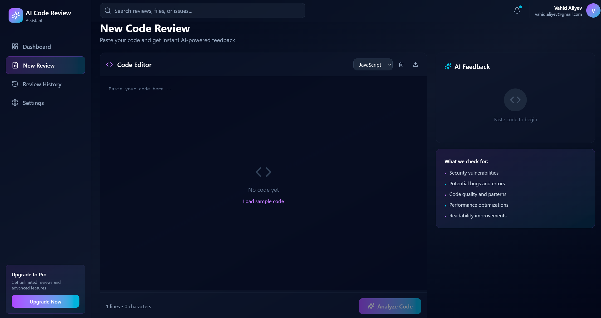
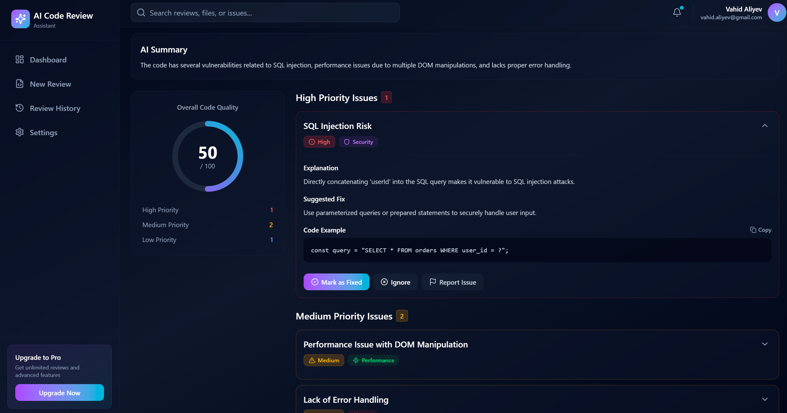
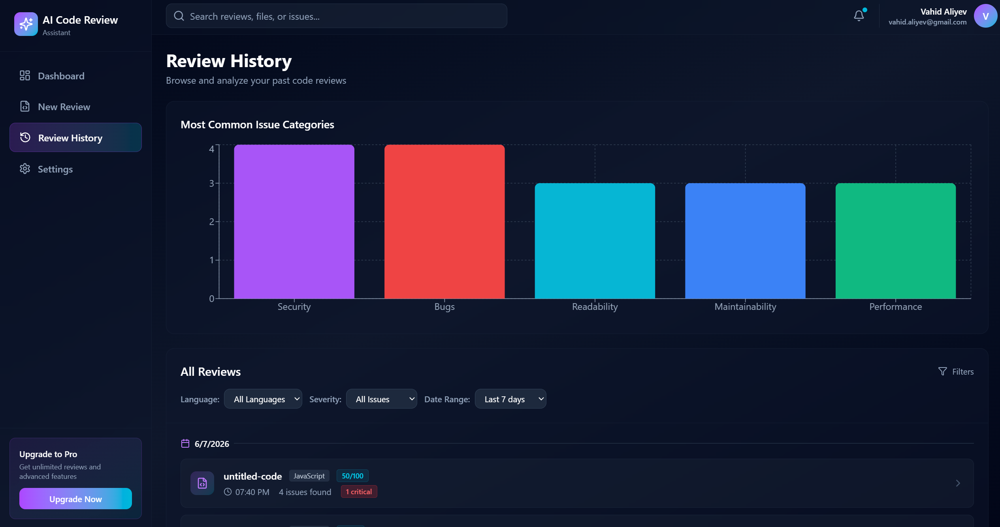
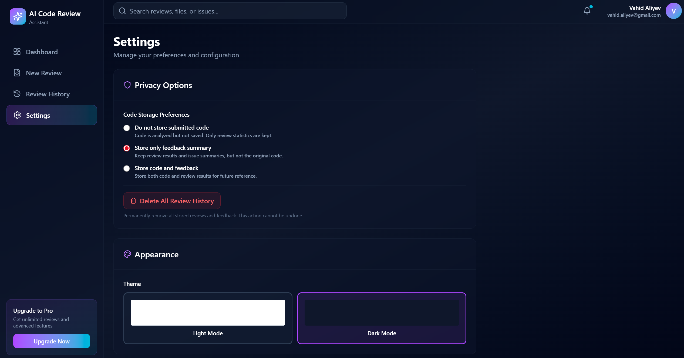

# AI Code Review Assistant

A full-stack AI-powered code review application that helps developers analyze code, detect potential bugs, identify security risks, improve readability, and track review history through a modern dashboard interface.

> This project was developed as a practical software prototype connected to the topic of AI-assisted code review automation, and it is also designed as a portfolio-ready full-stack application.

---

## 🚀 Live Demo

**Demo Link:** `ADD_YOUR_LIVE_DEMO_LINK_HERE`

**GitHub Repository:** `ADD_YOUR_GITHUB_REPOSITORY_LINK_HERE`

---

## 📸 Screenshots

Add your screenshots inside a folder such as:

```txt
frontend/public/screenshots/
```

Then replace the placeholders below with your real image paths.

### Landing Page



### Authentication Pages





### Dashboard



### New Code Review



### AI Review Results



### Review History



### Settings / Privacy Options



---

## ✨ Features

### 🔐 Authentication

- User registration and login
- JWT-based protected routes
- Password hashing with bcrypt
- Logged-in user data displayed in the application navbar
- Logout functionality

### 🤖 AI-Powered Code Review

- Submit code snippets for automated review
- OpenAI-powered feedback generation
- Mock AI fallback if OpenAI is disabled, unavailable, or usage limit is reached
- Structured review output including:
  - Overall quality score
  - Issue severity
  - Issue category
  - Explanation
  - Suggested fix
  - Code example

### 🧠 Review Categories

The system can classify findings into categories such as:

- Security
- Bugs
- Readability
- Maintainability
- Performance

### 📊 Dashboard

- Total reviews
- Total issues found
- Critical issues count
- Average code quality score
- Recent reviews table
- Quick navigation to review details

### 🕘 Review History

- View all previous reviews
- Filter by language
- Filter by critical issues
- Filter by date range
- Visual chart for common issue categories

### 🔒 Privacy Settings

Users can choose how submitted code is stored:

- **Do not store submitted code** — feedback and review metadata are stored, but raw submitted code is not saved.
- **Store only feedback summary** — review results are stored without saving the original code.
- **Store code and feedback** — submitted code and review results are saved for future reference.

### 💸 OpenAI Usage Limit

To avoid uncontrolled API spending, the backend supports a per-user OpenAI review limit. After the configured limit is reached, the system automatically switches to mock analysis.

Example:

```env
OPENAI_REVIEW_LIMIT=10
```

---

## 🛠️ Tech Stack

### Frontend

- React
- TypeScript
- Vite
- Tailwind CSS
- React Router
- Lucide React
- Recharts

### Backend

- Node.js
- Express.js
- TypeScript
- MongoDB
- Mongoose
- JWT
- bcryptjs
- OpenAI API

### Database

- MongoDB Atlas

---

## 📁 Project Structure

```txt
AI_Code_Review_App/
├── backend/
│   ├── src/
│   │   ├── config/
│   │   │   └── db.ts
│   │   ├── controllers/
│   │   │   ├── authController.ts
│   │   │   ├── dashboardController.ts
│   │   │   └── reviewController.ts
│   │   ├── middleware/
│   │   │   └── authMiddleware.ts
│   │   ├── models/
│   │   │   ├── User.ts
│   │   │   └── Review.ts
│   │   ├── routes/
│   │   │   ├── authRoutes.ts
│   │   │   ├── dashboardRoutes.ts
│   │   │   └── reviewRoutes.ts
│   │   ├── services/
│   │   │   └── aiReviewService.ts
│   │   └── server.ts
│   ├── package.json
│   └── tsconfig.json
│
├── frontend/
│   ├── public/
│   ├── src/
│   │   ├── app/
│   │   │   ├── components/
│   │   │   ├── context/
│   │   │   ├── pages/
│   │   │   ├── services/
│   │   │   ├── App.tsx
│   │   │   └── routes.tsx
│   │   ├── styles/
│   │   └── main.tsx
│   ├── index.html
│   ├── package.json
│   └── vite.config.ts
│
├── README.md
└── .gitignore
```

---

## ⚙️ Installation & Setup

### 1. Clone the repository

```bash
git clone ADD_YOUR_GITHUB_REPOSITORY_LINK_HERE
cd AI_Code_Review_App
```

---

## 🔧 Backend Setup

```bash
cd backend
npm install
```

Create a `.env` file inside the `backend` folder:

```env
PORT=5000
MONGO_URI=your_mongodb_atlas_connection_string
JWT_SECRET=your_jwt_secret_key

OPENAI_API_KEY=your_openai_api_key
OPENAI_MODEL=gpt-4o-mini
USE_OPENAI=true
OPENAI_REVIEW_LIMIT=10
```

Run the backend server:

```bash
npm run dev
```

The backend should run on:

```txt
http://localhost:5000
```

---

## 🎨 Frontend Setup

Open a second terminal:

```bash
cd frontend
npm install
npm run dev
```

The frontend should run on:

```txt
http://localhost:5173
```

---

## 🔑 Environment Variables

### Backend `.env`

| Variable | Description |
|---|---|
| `PORT` | Backend server port |
| `MONGO_URI` | MongoDB Atlas connection string |
| `JWT_SECRET` | Secret key for JWT token generation |
| `OPENAI_API_KEY` | OpenAI API key |
| `OPENAI_MODEL` | OpenAI model used for analysis |
| `USE_OPENAI` | Enables or disables OpenAI analysis |
| `OPENAI_REVIEW_LIMIT` | Maximum OpenAI-powered reviews per user |

---

## 📡 API Endpoints

### Authentication

| Method | Endpoint | Description |
|---|---|---|
| `POST` | `/api/auth/register` | Register a new user |
| `POST` | `/api/auth/login` | Login user |
| `GET` | `/api/auth/me` | Get authenticated user |
| `PUT` | `/api/auth/settings` | Update user privacy settings |

### Reviews

| Method | Endpoint | Description |
|---|---|---|
| `POST` | `/api/reviews/analyze` | Analyze submitted code |
| `GET` | `/api/reviews` | Get all reviews for logged-in user |
| `GET` | `/api/reviews/:id` | Get single review details |
| `DELETE` | `/api/reviews/:id` | Delete a review |

### Dashboard

| Method | Endpoint | Description |
|---|---|---|
| `GET` | `/api/dashboard/stats` | Get dashboard statistics |

---

## 🧪 Example Test Code

You can use this sample code to test the AI review functionality:

```js
async function loadUserOrders(userId) {
  var query = "SELECT * FROM orders WHERE user_id = " + userId;

  const response = await fetch("/api/orders/" + userId);
  const orders = await response.json();

  var total = 0;

  for (var i = 0; i < orders.length; i++) {
    total += orders[i].price * orders[i].quantity;
  }

  document.querySelector(".order-count").innerHTML = orders.length;
  document.querySelector(".order-total").innerHTML = total;

  return {
    orders: orders,
    total: total,
    query: query
  };
}

loadUserOrders(12);
```

Possible feedback may include:

- SQL injection risk
- Missing error handling
- Usage of `var` instead of `let` or `const`
- Maintainability improvements
- Performance or readability suggestions

---

## 🧩 How the AI Review Flow Works

```txt
User submits code
        ↓
Frontend sends request to backend
        ↓
Backend checks authentication
        ↓
Backend checks OpenAI usage limit
        ↓
OpenAI analysis runs if allowed
        ↓
Mock analysis runs if OpenAI is disabled or limit is reached
        ↓
Review result is saved according to user privacy settings
        ↓
Frontend displays structured feedback
```

---

## 🔒 Security & Privacy Notes

- API keys are stored only in backend environment variables.
- OpenAI API key is never exposed to the frontend.
- Passwords are hashed before being stored.
- JWT is used for protected API routes.
- Users can choose whether submitted code should be stored.
- The system includes a usage limit to prevent unexpected OpenAI API costs.

---

## 🧠 What I Learned

While building this project, I practiced and improved skills in:

- Full-stack application architecture
- Authentication and protected routes
- MongoDB data modeling
- API design with Express.js
- AI API integration
- Structured AI responses
- Frontend state management
- Dashboard UI development
- Privacy-aware feature design
- Real-world software project organization

---

## 🚀 Future Improvements

- GitHub repository integration
- File upload support for code review
- Pull request review comments
- More advanced OpenAI prompt tuning
- Team-based workspaces
- Role-based access control
- Export review report as PDF
- Email notifications
- Real Google OAuth authentication
- More detailed analytics and charts

---

## 👤 Author

**Vahid Aliyev**

- Computer Science Master's Student
- Full-Stack / Software Developer
- Focus: AI-assisted developer tools, full-stack web applications, and software quality automation

---

## 📄 License

This project is currently intended for academic and portfolio purposes.

You can add a license such as MIT later if you want to make it open source.
